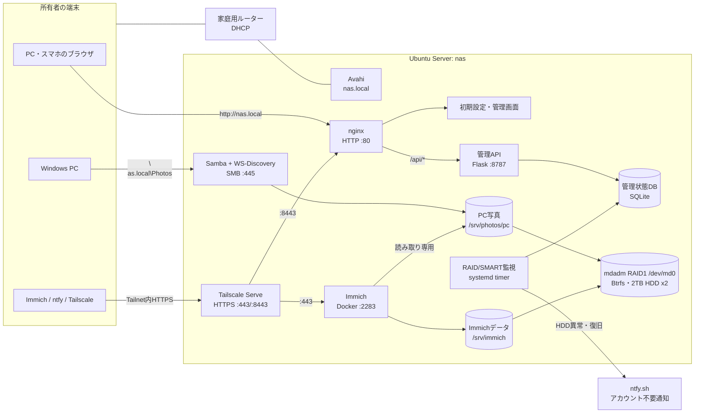
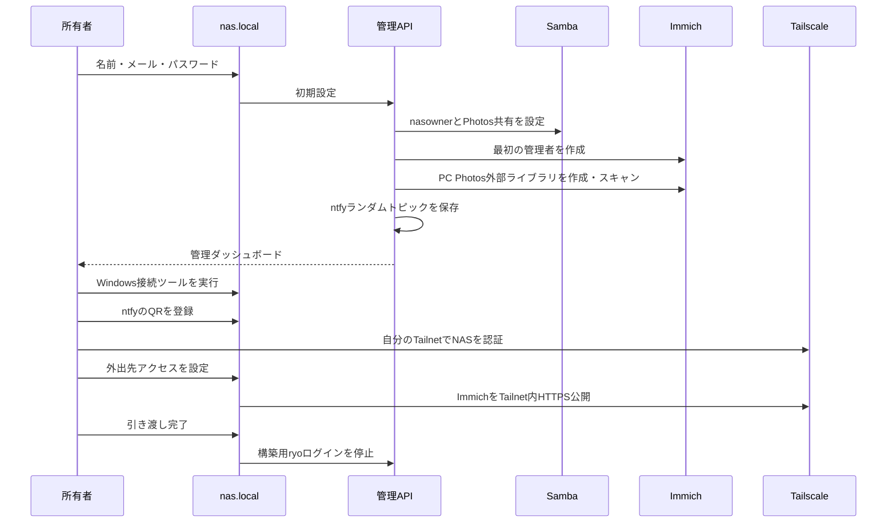

# Photo NAS Architecture

更新日: 2026-09-04

## 概要

Ubuntu Serverを、CLIを使えない所有者でも利用できる写真NASとして構成する。利用者の入口は `http://nas.local`。初回画面からWindows写真共有、Immich、HDD故障通知、所有者用Tailscaleを設定する。

販売者用の遠隔保守アカウント、権限申請、一時昇格機能は設けない。秘密情報、パスワード、通知トピック、写真データはGitHubへ保存しない。

## 全体構成



## 利用経路

| 利用目的 | URL・接続先 | 実体 |
|---|---|---|
| 初期設定・NAS管理 | `http://nas.local` | nginx → 静的管理画面 |
| Immich（LAN） | `http://nas.local:2283` | Docker上のImmich |
| Immich（外出先） | `https://nas.<所有者のtailnet名>.ts.net` | Tailscale Serve → Immich |
| NAS管理（Tailnet内） | 同URLの`:8443` | Tailscale Serve → nginx |
| Windows写真共有 | `\\nas.local\Photos` | Samba `/srv/photos/pc` |

NASはルーターからDHCPでIPアドレスを取得し、Avahiが `nas.local` を広告する。Windowsのネットワークドライブは、管理画面から `.cmd` をダウンロードし、所有者が一度実行して共有パスワードを入力する。ツールは資格情報と永続マッピングを保存するため、再起動後も再接続する。署名済み専用アプリは不要と判断した。

## 初期設定フロー



名前はImmichの表示名、メールはImmichログインID、パスワードはImmich・NAS管理画面・Windows共有の初期パスワードに使う。管理画面にはハッシュだけを保存し、平文は保存しない。

## 写真と権限

```text
/srv/photos/pc/          Windowsから保存するPC写真
/srv/immich/library/     スマホからImmichへアップロードした原本
/srv/immich/postgres/    Immichデータベース
/var/lib/nas-admin/      管理状態と秘密情報
```

| 主体 | PC写真 | 管理権限 | 用途 |
|---|---:|---:|---|
| `nasowner` | 読み書き | なし | Windows共有 |
| Immichコンテナ | 読み取り専用 | なし | PC写真の検索・表示 |
| `ryo` | 構築中のみ | 構築中のみ | 初期導入。引き渡し時に停止 |
| 管理API | 必要な設定のみ | rootサービス | 初期設定 |

所有者が「引き渡しを完了する」と、`ryo` のSSH鍵、パスワード、sudo所属、ログインシェルを停止し、既存セッションも終了する。販売者用アカウントはないため、以後の販売者SSH経路はない。

PC写真はImmichへ読み取り専用で渡し、Windows側を原本管理の正とする。スマホ写真とPC写真は同じImmich所有者のタイムラインへ表示される。同じ写真を両方へ入れると二重表示になる可能性がある。

## Tailscale

Tailscaleは所有者が外出先からImmichを見るためにだけ使用する。初回画面が現在の構築用Tailnetからログアウトし、所有者本人の認証URLを表示する。登録後にTailscale ServeでImmichをHTTPS `:443`、管理画面を`:8443`へTailnet内限定で公開する。公開インターネットへは露出しない。

## HDD・RAID通知

`nas-disk-monitor.timer` が起動時と1時間ごとに次を確認する。

- `/dev/md0` の期待メンバー数と稼働メンバー数
- RAID1状態が `[UU]` であること
- `/dev/sda` と `/dev/sdb` が存在すること
- 各HDDのSMART総合判定

異常発生時、未解決24時間後、復旧時にntfyへ通知する。同じ異常は連投しない。ntfyはログインやAPIキーを必要としないが、ランダムなトピックURL自体を秘密として扱う。NAS全体の電源断はNAS自身から通知できない。

## 自動起動

- `nginx.service`
- `nas-admin.service`
- `nas-disk-monitor.timer`
- `smbd.service`
- `wsdd-server.service`
- `avahi-daemon.service`
- `docker.service`
- `tailscaled.service`
- `smartmontools.service`

ImmichはDocker Composeのrestart policyで復帰する。管理APIは `127.0.0.1:8787` のみにbindし、nginx経由で利用する。

## 未実装・制約

- RAIDはバックアップではない。別媒体へのバックアップと復元テストは未実装
- Btrfs scrub、週次SMARTセルフテスト、外部ハートビートは未実装
- 更新前バックアップ、自動更新、ロールバックは未実装
- 引き渡し後の販売者による遠隔サポートは提供しない
