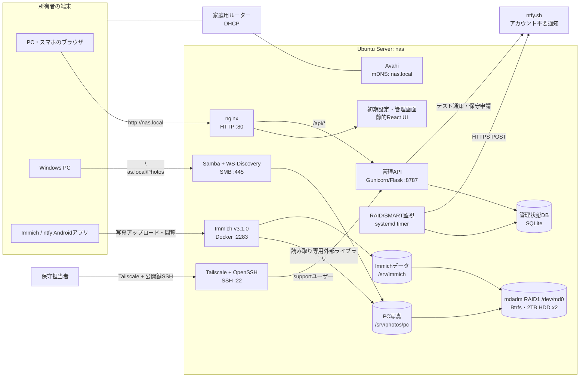
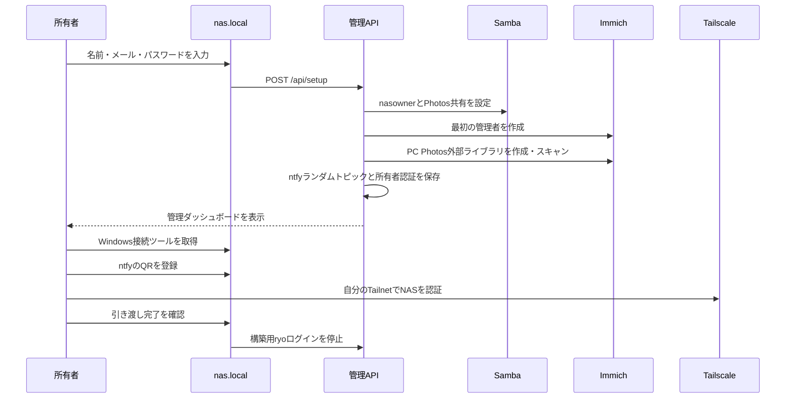
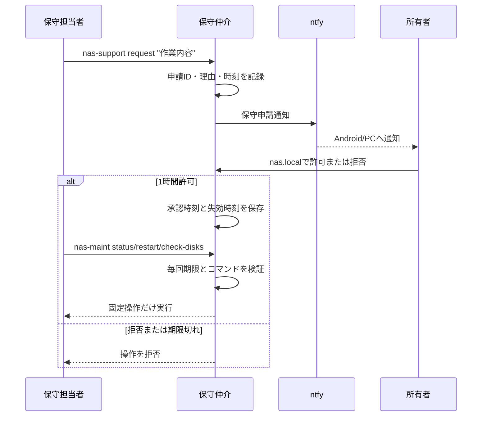

# Photo NAS Architecture

更新日: 2026-08-25

## 概要

Ubuntu Serverを、CLIを使えない所有者でも利用できる写真NASとして構成している。利用者の入口は `http://nas.local` に集約し、WindowsのPC写真、スマホのImmich写真、ディスク故障通知、遠隔保守の初期設定をブラウザから行う。

この文書は2026-08-25時点で実機へ導入済みの構成を示す。秘密情報、パスワード、通知トピック、写真データはGitHubへ保存しない。

## 全体構成



## ストレージ

```text
/dev/sda2 ─┐
           ├─ mdadm RAID1 /dev/md0 ─ Btrfs ─ /
/dev/sdb2 ─┘

/srv/photos/pc/          Windowsから保存するPC写真
/srv/immich/library/     スマホからImmichへアップロードした原本
/srv/immich/postgres/    Immichデータベース
/var/lib/nas-admin/      管理状態、監査ログ、秘密情報
```

- 実機は2TB HDD 2台のRAID1で、正常時は `/proc/mdstat` が `[UU]` を示す。
- Sambaは `/srv/photos/pc` を `Photos` として読み書き共有する。
- Immichコンテナには同じディレクトリを `/mnt/external/pc:ro` として渡す。
- PC写真の原本操作はWindows側を正とし、ImmichからPC写真を削除・変更させない。
- スマホ写真とPC写真は、同じImmich所有者のタイムラインへ統合表示する。
- RAID1は冗長化でありバックアップではない。別媒体または別拠点バックアップは別途必要。

## Web入口とサービス経路

| 利用目的 | URL・接続先 | 実体 |
|---|---|---|
| 初期設定・NAS管理 | `http://nas.local` | nginx → 静的管理画面 |
| 管理API | `http://nas.local/api/*` | nginx → `127.0.0.1:8787` |
| Immich | `http://nas.local:2283` | Docker上のImmich Server |
| Windows写真共有 | `\\nas.local\Photos` | Samba `/srv/photos/pc` |
| Windows自動検出 | Windowsの「ネットワーク」 | WS-Discovery |
| 遠隔保守 | Tailscale IP/名前のSSH :22 | OpenSSH `support` ユーザー |

NASは家庭用ルーターからDHCPでIPアドレスを取得する。Avahiが `nas.local` を広告するため、通常はIPアドレスを確認する必要がない。ブラウザの安全制限上、Windowsのネットワークドライブを無確認で追加することはできないため、管理画面から接続用 `.cmd` をダウンロードし、所有者が一度実行してパスワードを入力する。

## 初期設定フロー



初期設定完了後は同じURLが所有者ダッシュボードへ切り替わり、所有者パスワードによるログインが必要になる。

## 認証情報と秘密情報

ランタイム状態は `/var/lib/nas-admin/state.db` に保存し、ディレクトリをroot専用の `0700` とする。

保存対象:

- 所有者名・メールアドレス
- scrypt形式のNAS管理パスワードハッシュ
- 推測困難なランダムntfyトピック
- Immich外部ライブラリID
- 保守申請、期限、監査ログ
- 初期設定・Tailscale引き渡し状態

平文パスワード、Immichデータベース秘密情報、写真、ntfyトピックをGitへコミットしない。

## 権限分離

| 主体 | 写真フォルダ | root権限 | 用途 |
|---|---:|---:|---|
| `nasowner` | 読み書き | なし | Windows SMB所有者 |
| Immichコンテナ | 読み取り専用 | なし | PC写真の検索・表示 |
| `support` | アクセス不可 | 一般sudoなし | 遠隔保守申請 |
| `ryo` | 構築中のみ | 構築中のみ | 初期導入。引き渡し時に停止 |
| 管理API | 必要な設定のみ | rootサービス | 初期構築と固定操作の仲介 |

所有者が「引き渡しを完了する」を実行すると、構築用 `ryo` アカウントのSSH鍵、パスワード、sudo所属、ログインシェルを停止し、既存セッションも終了する。以後は `support` 経路だけを残す。

完全なroot権限を持つ人から、稼働中の平文写真を暗号学的に隠すことはできない。そのため保守担当者へrootシェルを渡さず、許可済みの固定操作だけをroot仲介プログラムが実行する。

## 遠隔保守フロー



許可される操作:

- RAIDと主要サービスの状態確認
- Immich、Samba、Tailscale、管理画面の再起動
- RAID/SMART確認の実行

任意のシェル、任意のコマンド、写真ファイルの参照は許可しない。所有者が自分のTailnetへ登録した後、保守を依頼する場合はTailscale側でも保守担当者へ対象NASへの到達権限を与える必要がある。

## HDD・RAID監視

`nas-disk-monitor.timer` が起動時と1時間ごとに次を確認する。

- `/dev/md0` の期待メンバー数と稼働メンバー数
- mdadm RAID1の状態が `[UU]` であること
- `/dev/sda` と `/dev/sdb` が物理デバイスとして存在すること
- 各HDDのSMART総合判定が失敗していないこと

異常が新しく発生した時にntfyへ通知し、同じ異常は連投しない。未解決の場合は24時間後に再通知し、正常へ戻った時は復旧通知を送る。ntfyはログインとAPIキーを必要としないが、ランダムトピックURL自体を秘密として扱う。

## systemdと自動起動

主要な永続サービス:

- `nginx.service`
- `nas-admin.service`
- `nas-disk-monitor.timer`
- `smbd.service`
- `wsdd-server.service`
- `avahi-daemon.service`
- `docker.service`
- `tailscaled.service`
- `smartmontools.service`

ImmichはDocker Composeのrestart policyで復帰する。管理APIは `127.0.0.1:8787` のみにbindし、外部からはnginx経由でアクセスする。

## ソースと実機配置

| リポジトリ | 実機 |
|---|---|
| `nas-admin-service/` | `/opt/nas-admin-service/` |
| `nas-admin-ui/` の静的ビルド | `/opt/nas-admin-ui-static/` |
| `nas-admin-service/deploy/nas-admin.nginx` | `/etc/nginx/sites-available/nas-admin` |
| Samba設定断片 | `/etc/samba/nas-admin.conf` |
| Avahiサービス定義 | `/etc/avahi/services/nas-admin.service` |
| systemd unit | `/etc/systemd/system/nas-*` |

実装状況と引き渡し操作は `IMPLEMENTATION_STATUS.md`、設計上の判断と限界は `NAS_PRODUCT_DESIGN.md`、接続・導入履歴は `NAS_CONNECTION.md` を参照。

## 未実装・将来拡張

- RAIDとは別媒体への自動バックアップと復元テスト
- Btrfs scrubと週次SMARTセルフテスト
- NAS全体の停止を外部から検出するハートビート
- 更新前バックアップと自動ロールバック
- 署名済みWindowsヘルパーによる接続操作の簡略化
- 認証付きセルフホストntfyへの移行
